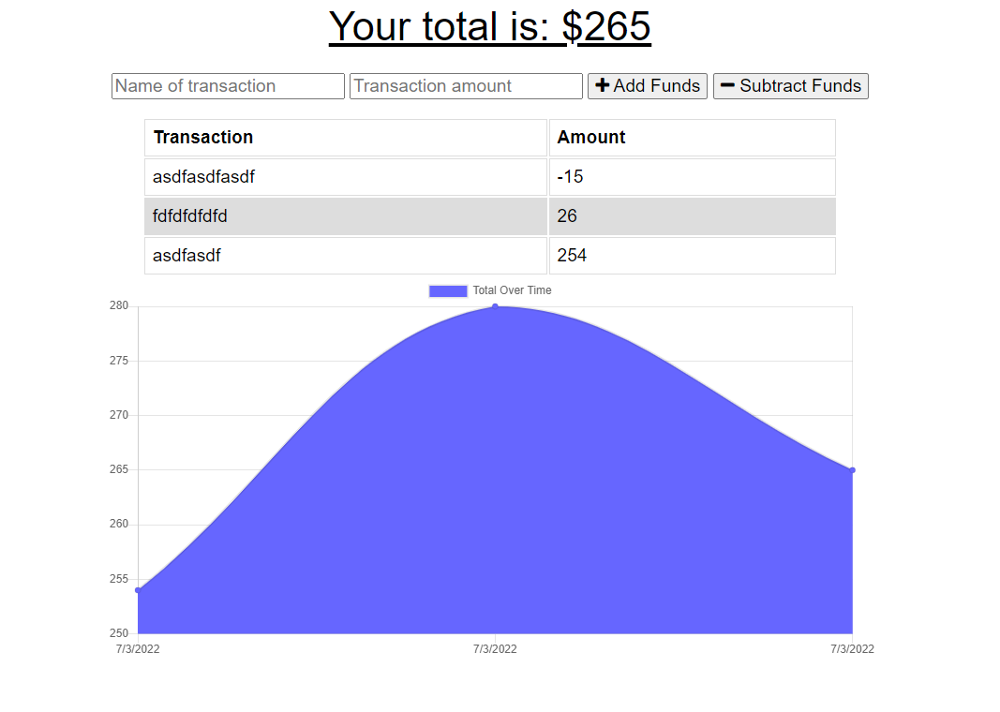

  # Budget-Trackinator
  ## Badge
  
  ## Description 
  A simple web application using a service worker, db to cache files, (PWA), that tracks budget using addition and subtraction and a name for transactions. Deployed to Heroku
  ## Table of contents
  - [Installation](#Installation)
  - [Usage](#Usage)
  - [License](#License)
  - [Contributions](#Contributions)
  - [Testing](#Testing)
  - [Repository Link](#Repository)
  - [GitHub Info](#GitHub) 
  ## Installation
  download package.json and run npm i or use deployment
  ## Usage
  Add or subtract values and name them, view the results on a chart. 
  ## License
  
  ## Contributions
  Christopher Hoke AKA James Primitive
  ## Testing
  Test by use
  ## Repository
  https://github.com/PrimitiveJ/pwa-budgetinatoratron
  ## GitHub
  PrimitiveJ
  ## Heroku Deployment
  https://budget-trackinator.herokuapp.com/
  ## Contact
  hokecj@gmail.com
  This README.md was generated using READLEMETHIS.
  